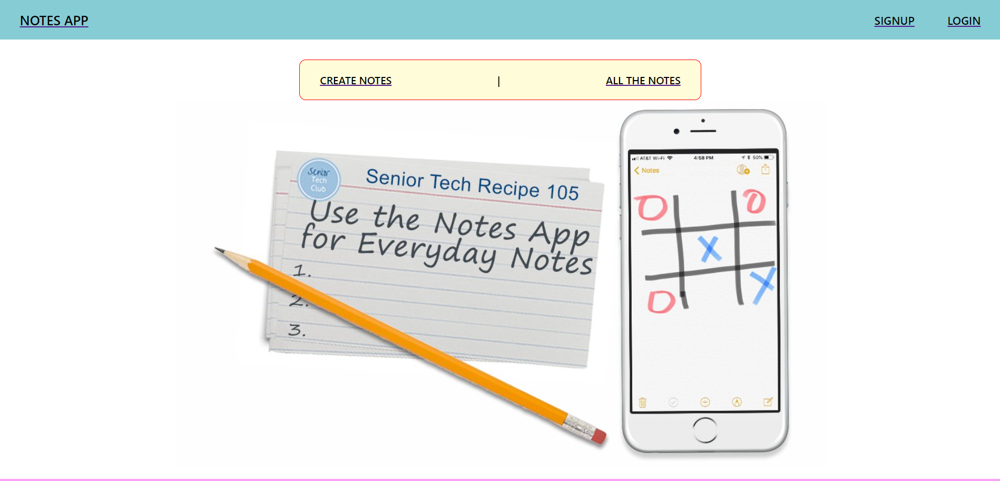
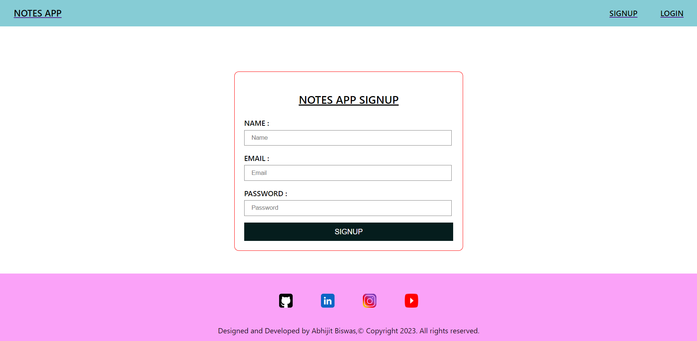
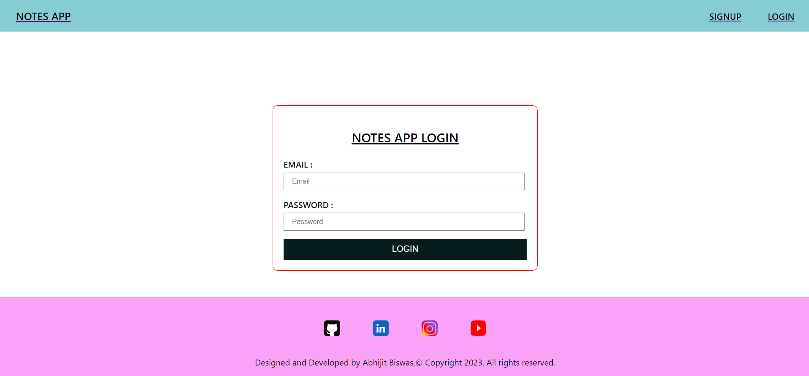
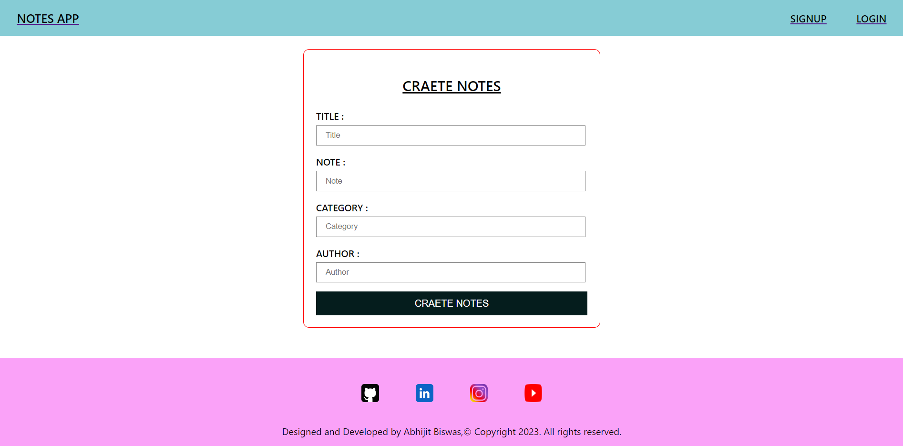
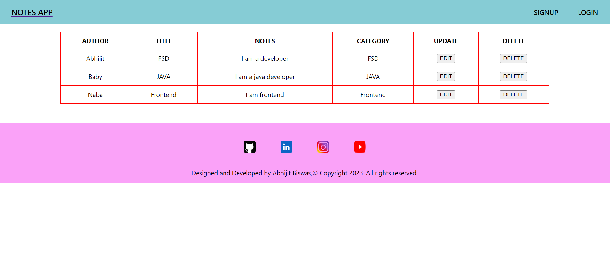

## BASIC NOTES APP FRONTEND

## About

- This is frontend of a simple basic notes app.
- For backend just visit this link 👇👇👇
- [Basic-Notes-App-Backend](https://github.com/abhijitnr/Basic-Notes-App-Backend)

## Live link 👇👇👇

- [MY NOTES APP](https://abhijit-basic-notes-app.netlify.app/)

## Folders and Files structure

- ### public

  - [index.html](./public/index.html)

- ### src

  - assets

    - [Github icon](./src/assets/github.png)
    - [Home icon](./src/assets/home.jpg)
    - [Instagram icon](./src/assets/instagram.png)
    - [LinkedIn icon](./src/assets/linkedin.png)
    - [YouTube icon](./src/assets/youtube.png)

  - components

    - [Footer.css](./src/components/Footer.css)

    - [Footer.jsx](./src/components/Footer.jsx)

    - [Home.css](./src/components/Home.css)

    - [Home.jsx](./src/components/Home.jsx)

    - [Navbar.css](./src/components/Navbar.css)

    - [Navbar.jsx](./src/components/Navbar.jsx)

  - pages

    - [AllNotes.css](./src/pages/AllNotes.css)

    - [AllNotes.jsx](./src/pages/AllNotes.jsx)

    - [CreateNotes.jsx](./src/pages/CreateNotes.jsx)

    - [Login.jsx](./src/pages/Login.jsx)

    - [Signup.css](./src/pages/Signup.css)

    - [AllNotes.css](./src/pages/Signup.jsx)

  - [App.js](./src/App.js)

  - [index.css](./src/index.css)

  - [index.js](./src/index.js)

- ### .gitignore

- ### [package-lock.json](./package-lock.json)

- ### [package.json](./package.json)

## Dependencies

- react-router-dom

## Usage Guide

- https://github.com/abhijitnr/Basic-Notes-App-Frontend.git
- npm install
- npm start
- now frontend is ready to use

## Overview

- ## Navbar and Home page

  

- ## Footer

  

- ## Signup

  

- ## Login

  

- ## Create Notes

  

- ## All Notes

  

## <---------- Thanks for visit ---------->

## <---------- HAPPY CODING ---------->
